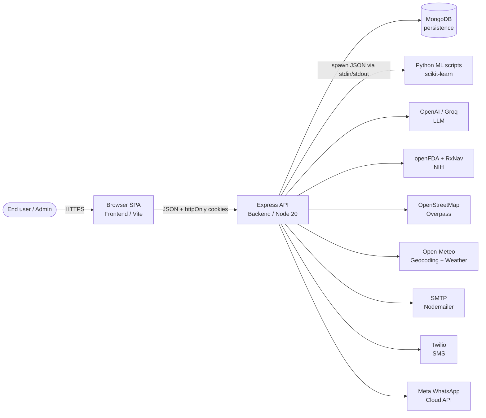
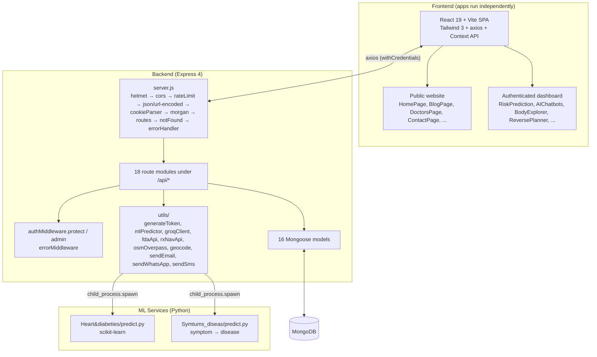
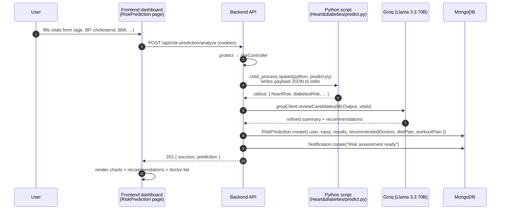

# Architecture

This document describes HealanceAI-Orbit as it exists today. It complements the deeper backend bootstrap notes in [docs/ARCHITECTURE.md](docs/ARCHITECTURE.md) with system-context views, an entity relationship diagram, and the primary-workflow sequence.

For routing details, see [docs/API.md](docs/API.md). For decisions and trade-offs, see [docs/ADRs/](docs/ADRs/).

---

## 1. System context



Three tiers, four owned components, seven third-party integrations.

---

## 2. Container view



Two apps install and run independently — `Frontend/` via Vite (`npm run dev` on `:5173`), `Backend/` via nodemon (`npm run dev` on `:5000`). The backend invokes Python scripts on demand via `child_process.spawn`; see [ADR-0004](docs/ADRs/0004-ml-subprocess-bridge.md).

---

## 3. Request pipeline

Every request to the Express API passes through this chain (defined in [Backend/server.js](Backend/server.js)):

```mermaid
flowchart LR
  req[Incoming<br/>HTTP request] --> helmet[helmet<br/>security headers]
  helmet --> cors[cors<br/>credentialed, origin allowlist]
  cors --> rl["express-rate-limit<br/>1200/15min global<br/>60/15min on /api/auth"]
  rl --> body["express.json (10MB)<br/>+ urlencoded"]
  body --> cookies[cookieParser]
  cookies --> log[morgan<br/>dev only]
  log --> static[express.static<br/>/uploads]
  static --> mount[router mount<br/>/api/auth, /api/users, ...]
  mount --> auth["protect → admin (where applicable)"]
  auth --> ctrl[controller]
  ctrl --> respond[res.status.json]
  ctrl -.error.-> notfound[notFound<br/>fallthrough] --> err[errorMiddleware<br/>maps Mongoose / JWT / generic]
```



The error middleware in [Backend/middleware/errorMiddleware.js](Backend/middleware/errorMiddleware.js) is the last `app.use`; it maps Mongoose `CastError` → 404, duplicate-key → 400, `ValidationError` → 400, `JsonWebTokenError` → 401, `TokenExpiredError` → 401, and otherwise echoes a generic 500.

---

## 4. Authentication sequence

```mermaid
sequenceDiagram
  autonumber
  participant U as User
  participant FE as Frontend (axios)
  participant BE as Backend (Express)
  participant DB as MongoDB

  U->>FE: enters email + password
  FE->>BE: POST /api/auth/login
  BE->>DB: User.findOne(email).select(+password)
  DB-->>BE: user doc
  BE->>BE: bcrypt.compare(password, user.password)
  BE->>BE: jwt.sign(id, JWT_SECRET) — 15m access<br/>jwt.sign(id, JWT_REFRESH_SECRET) — 30d refresh
  BE-->>FE: 200 + Set-Cookie: accessToken; refreshToken; token (httpOnly)<br/>body { success, user, accessToken }
  FE->>FE: cache user in AuthContext

  Note over FE,BE: Subsequent authenticated requests
  FE->>BE: GET /api/* (cookies sent automatically; withCredentials: true)
  BE->>BE: protect middleware reads Authorization header → falls back to cookie<br/>jwt.verify → User.findById → req.user
  BE-->>FE: 200 + payload

  Note over FE,BE: Access token expired
  FE->>BE: GET /api/something
  BE-->>FE: 401 Unauthorized
  FE->>BE: POST /api/auth/refresh (refreshToken cookie)
  BE-->>FE: 200 + Set-Cookie: accessToken (new)
  FE->>BE: retry original GET /api/something (one retry, _retry=true)
  BE-->>FE: 200 + payload
```

The cookie-vs-header trade-off and OTP fallbacks (WhatsApp, SMS) are documented in [ADR-0003](docs/ADRs/0003-jwt-cookie-auth.md).

---

## 5. Primary workflow — vitals to risk prediction

The platform's flagship interaction: an authenticated user submits health vitals and receives an ensemble ML+LLM risk assessment.



The Python subprocess design and its trade-offs are recorded in [ADR-0004](docs/ADRs/0004-ml-subprocess-bridge.md).

---

## 6. Entity relationship diagram (top entities)

```mermaid
erDiagram
  User ||--o{ HealthData : logs
  User ||--o{ RiskPrediction : owns
  User ||--o{ ChatSession : chats
  User ||--o{ Goal : pursues
  User ||--o{ WalkEarn : earns
  User ||--o{ Redemption : redeems
  User ||--o{ MedicalReport : uploads
  User ||--o{ Notification : receives
  User ||--o{ SupportTicket : files
  User }o--o{ Blog : bookmarks
  Reward ||--o{ Redemption : fulfills
  Doctor }o--|| RiskPrediction : "may be recommended in"

  User {
    string email UK
    string password "bcrypt"
    string role "user|admin"
    string plan "free|premium|enterprise"
    object profile "age,gender,height,weight,bloodGroup,medicalConditions,medications"
    int coins
    int totalStepsAllTime
    string whatsappNumber UK
  }
  HealthData {
    objectId user FK
    date date
    object vitals
    object activity
    int waterIntake
    object sleep
    int healthScore "0-100"
  }
  RiskPrediction {
    objectId user FK
    object input
    object results "overallRisk, percentages, summary"
    array recommendations
    array recommendedDoctors
  }
  ChatSession {
    objectId user FK
    string botType "health|medicine"
    array messages
    string title
  }
  Goal {
    objectId user FK
    string type "steps|water|calories|sleep|weight|custom"
    number current
    number target
    array weeklyProgress
  }
  WalkEarn {
    objectId user FK
    date date
    int steps
    int dailyGoal
    int coinsEarned
  }
  Reward {
    string title
    int coinsRequired
    string category
    int stock
  }
  Redemption {
    objectId user FK
    objectId reward FK
    int coinsSpent
    string status
  }
  Blog {
    string title UK
    string slug UK
    string category
    int views
    int likes
  }
  Doctor {
    string name
    string slug UK
    string specialty
    geojson location "2dsphere"
  }
  MedicalReport {
    objectId user FK
    string title
    string type
    object file
    object extractedData
  }
  Notification {
    objectId user FK
    string title
    string type
    boolean isRead
  }
  SupportTicket {
    objectId user FK
    string subject
    string status
    string priority
  }
```



Three additional models exist but are omitted from the ERD for clarity: `Contact` (public form, no FK), `SignupOtp` (15-minute TTL, ephemeral), and `SymptomPrediction` (similar to `RiskPrediction` but for symptom-driven flow).

---

## 7. Frontend container detail

The SPA uses React Router's `BrowserRouter` with two top-level layout zones:

- **Website layout** (`<WebsiteLayout />`) — public marketing routes (`/`, `/about`, `/services`, `/blog`, `/doctors`, `/contact`, …) plus password-reset (`/reset-password/:token`). Wraps navbar + footer.
- **Dashboard layout** (`<DashboardLayout />`) — gated by `<ProtectedRoute>` which inspects `AuthContext.user`. Routes: `/dashboard`, `/dashboard/risk-prediction`, `/dashboard/chatbots`, `/dashboard/body-explorer`, `/dashboard/reverse-planner`, `/dashboard/forecast`, `/dashboard/blogs`, `/dashboard/contact`, `/dashboard/profile`, `/dashboard/prediction-history`.

State management is intentionally minimal: two contexts (`AuthContext`, `HealthDataContext`) and per-component `useState`. There is no Redux, Zustand, or React Query; per-feature data is fetched eagerly in page components via `Frontend/src/services/api.js`. The axios instance has two interceptors:

- **401 handler** — calls `POST /api/auth/refresh` once, retries the original request.
- **429 handler** — exponential backoff up to 2 retries (1200ms base), respecting `Retry-After`.

---

## 8. Known limitations

- **No automated tests.** Neither tier has Jest, Vitest, or Mocha installed. Verification is manual; CI runs lint and build only.
- **In-process rate limiter.** `express-rate-limit` uses an in-memory store. Multi-instance deploys would need a Redis-backed store to enforce limits globally.
- **Refresh-token revocation is signature-only.** A leaked refresh token remains valid until expiry; there is no per-token blacklist or rotation. See [ADR-0003](docs/ADRs/0003-jwt-cookie-auth.md).
- **ML cold-start cost.** Each prediction spawns a Python interpreter; concurrent predictions do not batch. See [ADR-0004](docs/ADRs/0004-ml-subprocess-bridge.md).
- **No shared schemas between client and server.** Type drift is detected at runtime, not compile time. See [ADR-0002](docs/ADRs/0002-no-shared-schemas-package.md).
- **Implicit Python working directory.** `mlPredictor.js` inherits the Node cwd when spawning Python; relative paths inside Python scripts must account for this.
- **In-memory caches (Groq prompts, Overpass results, RxNav lookups).** Lost on process restart; not shared across instances.
- **Local file uploads.** `multer` writes to `./uploads`. No object-storage abstraction; deploying behind multiple instances requires a shared volume or a refactor.

---

## 9. Evolution paths

These are not commitments — they are the natural next steps the architecture leaves room for:

- **Object storage** for uploads (S3 / R2) when running more than one backend instance.
- **Redis** for the rate limiter, session blacklist, and Groq prompt cache.
- **OpenAPI generation** from the existing `docs/API.md` once a routing-time schema layer is introduced.
- **TypeScript** on either tier — deferred today to keep the doc-only pass zero-touch (see [ADR-0002](docs/ADRs/0002-no-shared-schemas-package.md)).
- **Mobile client** sharing the existing API; would push toward a Bearer-only auth flow alongside the cookie flow ([ADR-0003](docs/ADRs/0003-jwt-cookie-auth.md)).
